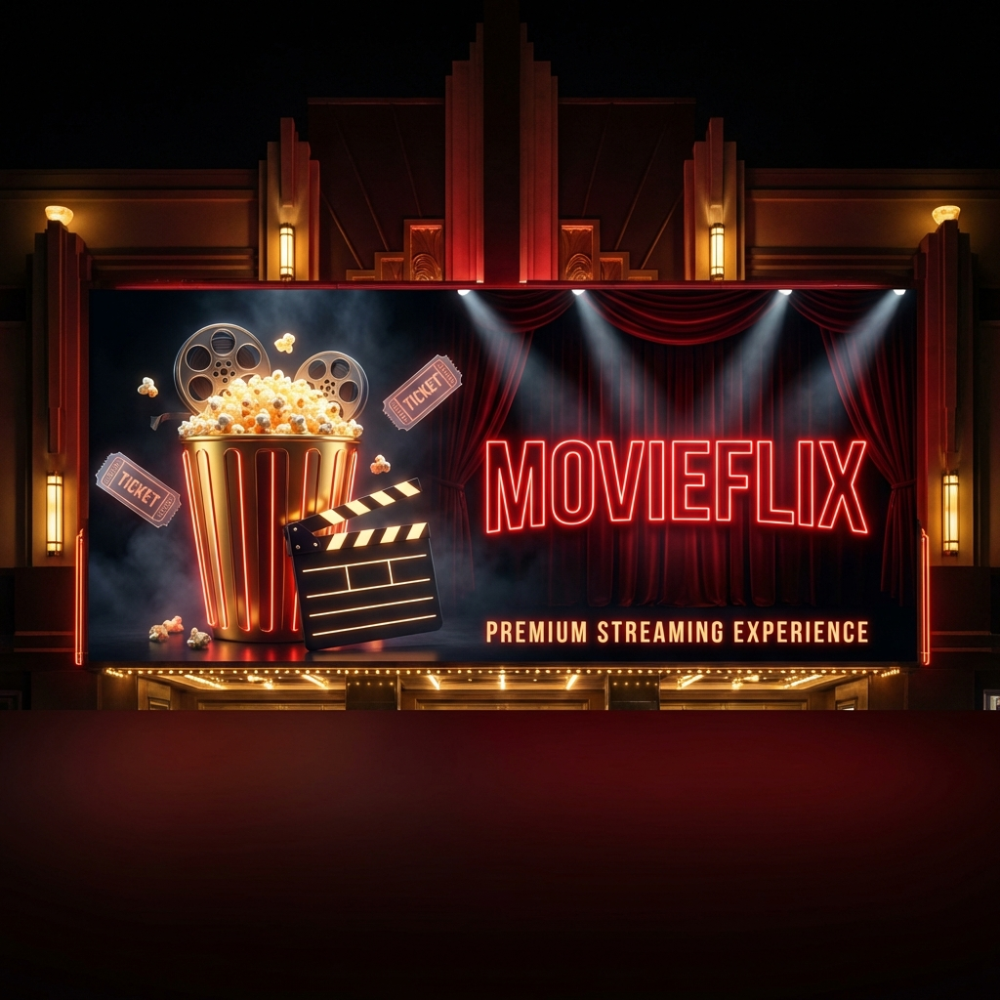
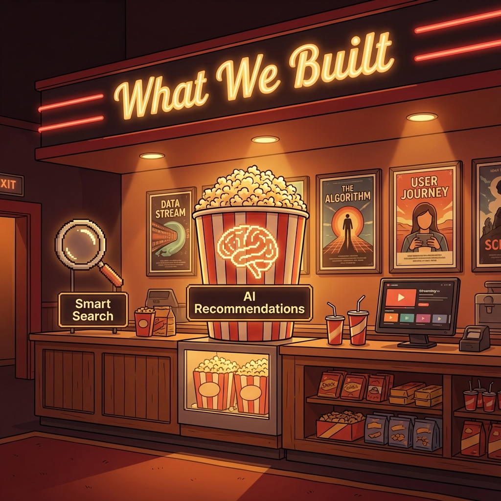
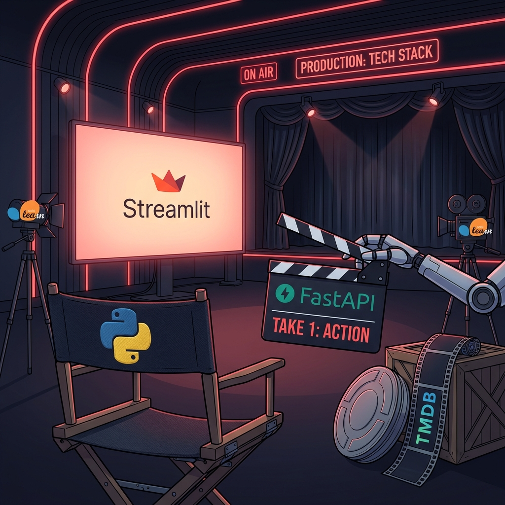
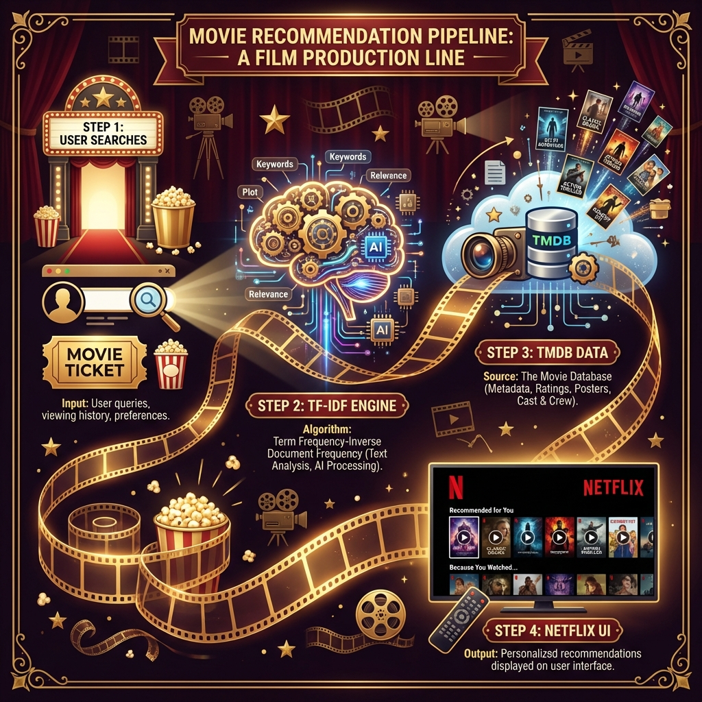
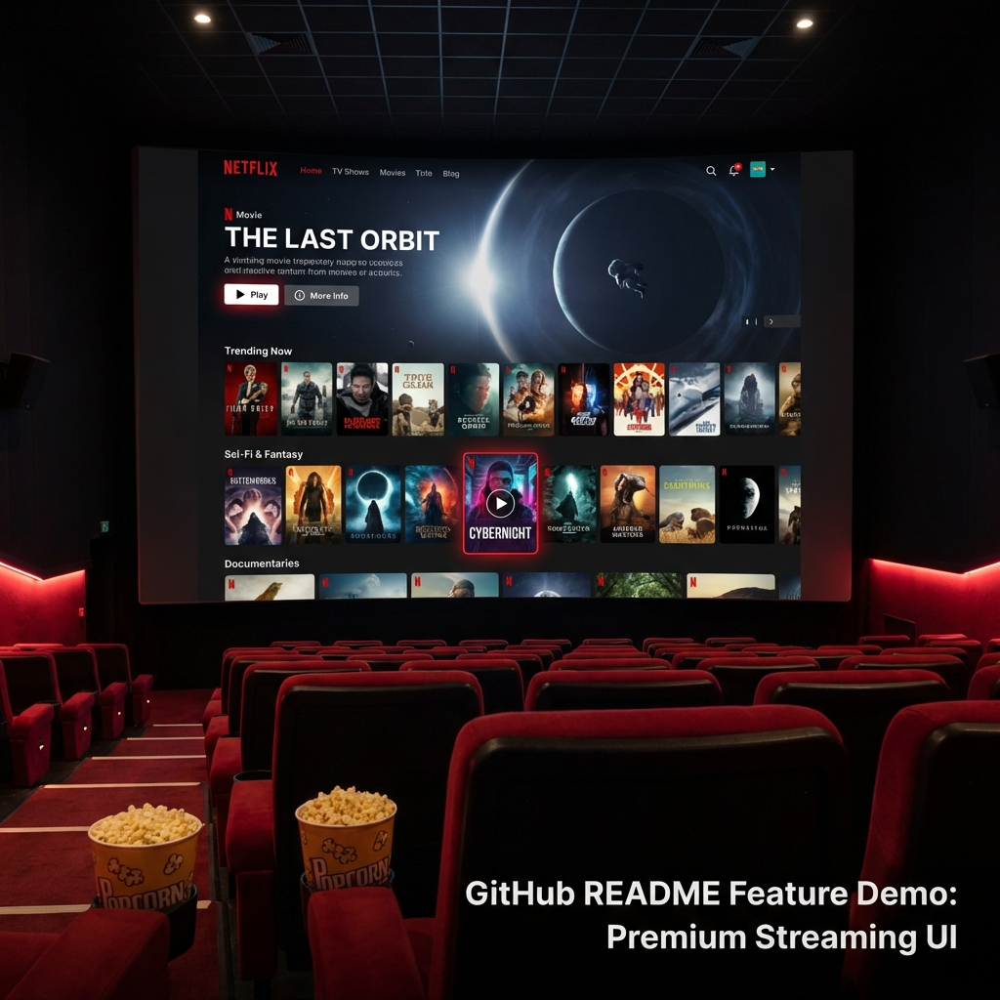

# 🎬🍿 MOVIEFLIX - AI MOVIE RECOMMENDER 🍿🎬

[](https://git.io/typing-svg)


[](https://movieflix-rec-fastapi.streamlit.app/)
[](https://colab.research.google.com/drive/1k3Lmdrctw-xoI1b2W8U1qhBfISY0YshK?usp=sharing)
[](https://movieflix-rec.onrender.com/docs)
[](https://github.com/mayank-goyal09/movieflix-rec/stargazers)
[](https://github.com/mayank-goyal09/movieflix-rec/network)

---

## 🎭 **WELCOME TO THE MOVIEFLIX THEATER** 🎭

<p align="center">
  
</p>

<p align="center">
  <b>🍿 Step into our cinema and discover movies you'll love! 🍿</b>
</p>

### 🎯 **Discover Your Next Favorite Movie with AI-Powered Recommendations** 🤖

### 🔥 TF-IDF NLP Engine × Genre Analysis × TMDB Data = **Smart Movie Discovery** 🎥

---

## 🍿 **WHAT WE BUILT - THE CANTEEN** 🍿

<p align="center">
  
</p>

Welcome to the **MovieFlix Canteen**! Just like grabbing popcorn before a movie, let us serve you the essentials of what we've created:

<table>
<tr>
<td width="50%">

### 🧠 **AI Recommendations (The Brain)**

Our **TF-IDF NLP Engine** analyzes movie descriptions and finds similar content based on text patterns. It's like having a movie expert who has watched everything!

- 📝 **Text Analysis** - Processes movie overviews
- 🔢 **TF-IDF Vectorization** - Converts text to numbers
- 📐 **Cosine Similarity** - Finds closest matches

</td>
<td width="50%">

### 🔍 **Smart Search (The Magnifying Glass)**

Search for any movie and get instant suggestions! Our system connects to **TMDB** (The Movie Database) for real-time data.

- ⚡ **Real-Time Search** - Instant suggestions
- 🎬 **TMDB Integration** - Fresh movie data
- 🖼️ **Rich Results** - Posters, ratings, genres

</td>
</tr>
<tr>
<td width="50%">

### 📊 **Data Stream (The Algorithm)**

We process **45,000+ movies** to find the perfect recommendations for you. Our pre-computed matrices make searches lightning fast!

- 📦 **Pickle Files** - Pre-trained models
- ⚡ **Fast Lookups** - O(1) index access
- 🗃️ **Rich Metadata** - Titles, genres, dates

</td>
<td width="50%">

### 👤 **User Journey (The Experience)**

From search to discovery, every step is designed to feel like **Netflix**. Beautiful dark UI, smooth animations, and intuitive navigation.

- 🌙 **Dark Theme** - Easy on the eyes
- ✨ **Hover Effects** - Interactive cards
- 📱 **Responsive** - Works everywhere

</td>
</tr>
</table>

---

## 🎬 **TECH STACK - THE PRODUCTION STUDIO** 🎬

<p align="center">
  
</p>

Just like a **movie production studio** has different departments, our project has specialized technologies for each role:

| **Role** | **Technology** | **Description** |
|----------|---------------|-----------------|
| 🎬 **Director** |  | Orchestrates the entire project |
| 🎥 **Clapperboard** |  | Commands the backend actions |
| 📺 **Cinema Screen** |  | Displays the beautiful UI |
| 🎞️ **Film Reel** |  | Stores all the movie content |
| 📹 **Camera Crew** |  | Captures patterns with ML |
| 📊 **Props Department** |   | Handles all the data |

### **Full Tech Breakdown:**

| **Category** | **Technologies** |
|--------------|------------------|
| 🐍 **Language** | Python 3.10+ |
| ⚡ **Backend API** | FastAPI, Uvicorn, HTTPX |
| 🎨 **Frontend** | Streamlit with 500+ lines of Custom CSS |
| 🧠 **ML/NLP** | Scikit-learn (TF-IDF Vectorizer, Cosine Similarity) |
| 📊 **Data Processing** | Pandas, NumPy, SciPy |
| 🎬 **Data Source** | TMDB API (The Movie Database) |
| 📂 **Dataset** | movies_metadata.csv (45,000+ movies) |
| ☁️ **Backend Hosting** | Render |
| 🚀 **Frontend Hosting** | Streamlit Cloud |
| 🔧 **Serialization** | Pickle (model persistence) |

---

## 🎞️ **HOW IT WORKS - THE PRODUCTION PIPELINE** 🎞️

<p align="center">
  
</p>

### **The Journey of a Recommendation:**

Our recommendation engine works like a **film production line**, with each stage adding value:

---

### 🎟️ **STEP 1: User Searches (Movie Ticket)**

When you search for a movie, you're buying a ticket to the recommendation show!

```python
# User input
query = "The Dark Knight"
```

- 📝 User types a movie title
- 🔍 Query sent to FastAPI backend
- 🎫 Search ticket created

---

### 🧠 **STEP 2: TF-IDF Engine (The AI Brain)**

Our **TF-IDF (Term Frequency-Inverse Document Frequency)** engine processes your request:

```python
from sklearn.feature_extraction.text import TfidfVectorizer
from sklearn.metrics.pairwise import cosine_similarity

# Vectorize movie descriptions
tfidf = TfidfVectorizer(stop_words='english')
tfidf_matrix = tfidf.fit_transform(movies['combined_features'])

# Find similar movies
query_idx = get_movie_index(query)
similarity_scores = cosine_similarity(tfidf_matrix[query_idx], tfidf_matrix)
top_similar = sorted(enumerate(similarity_scores[0]), key=lambda x: x[1], reverse=True)
```

- 🔢 **TF (Term Frequency)** - How often words appear in a movie description
- 📉 **IDF (Inverse Document Frequency)** - Reduces common word importance
- 📐 **Cosine Similarity** - Measures angle between movie vectors (closer = more similar)

---

### 🎬 **STEP 3: TMDB Data (The Movie Database)**

We enrich our local recommendations with **fresh TMDB data**:

```python
# Fetch movie details from TMDB
async def tmdb_movie_details(movie_id: int):
    response = await httpx.get(f"{TMDB_BASE}/movie/{movie_id}", params={"api_key": API_KEY})
    return {
        "title": response["title"],
        "poster_url": f"https://image.tmdb.org/t/p/w500{response['poster_path']}",
        "backdrop_url": f"https://image.tmdb.org/t/p/original{response['backdrop_path']}",
        "genres": response["genres"],
        "vote_average": response["vote_average"]
    }
```

- 🖼️ **Posters** - High-quality movie artwork
- ⭐ **Ratings** - Current user scores
- 🎭 **Genres** - For genre-based recommendations
- 📅 **Release Dates** - Latest information

---

### 📺 **STEP 4: Netflix UI (The Final Display)**

Everything comes together in our **stunning Netflix-style interface**:

- 🎥 **Hero Section** - Featured movie with backdrop
- 📜 **Carousels** - Horizontal scrolling movie rows
- 🃏 **Movie Cards** - Hover effects with play buttons
- 🔴 **Netflix Red** - #E50914 accent color throughout

---

## 🎨 **THE NETFLIX-STYLE UI** 🎨

<p align="center">
  
</p>

### **UI Features at a Glance:**

| **Feature** | **Description** | **Implementation** |
|-------------|-----------------|-------------------|
| 🌙 **Dark Theme** | Cinematic #141414 background | Custom CSS variables |
| 🔴 **Netflix Red** | #E50914 accent color | Buttons, hover effects, logo |
| 🎬 **Hero Section** | Featured movie with backdrop | Random selection from popular |
| 📜 **Movie Carousels** | Horizontal scrolling rows | Flexbox + overflow-x |
| ✨ **Hover Effects** | Scale + glow on cards | CSS transforms + box-shadow |
| 🃏 **Movie Cards** | Poster + info overlay | Absolute positioning |
| 🔍 **Search Bar** | Rounded with red focus | Custom input styling |
| 🎭 **Genre Pills** | Clickable genre badges | Border + hover animation |
| 📱 **Responsive** | Works on all devices | Media queries |

### **Custom CSS Highlights:**

```css
/* Netflix Color Scheme */
:root {
    --netflix-red: #E50914;
    --dark-bg: #141414;
    --card-bg: #181818;
    --shadow-glow: 0 0 40px rgba(229, 9, 20, 0.3);
}

/* Movie Card Hover Effect */
.movie-card:hover {
    transform: scale(1.08) translateY(-10px);
    box-shadow: var(--shadow-card), var(--shadow-glow);
}

/* Smooth Scrolling */
.movie-carousel {
    scroll-behavior: smooth;
    -webkit-overflow-scrolling: touch;
}
```

---

## 📂 **PROJECT STRUCTURE** 📂

```
🎬 movieflix-rec/
│
├── 🐍 main.py                    # FastAPI backend with all endpoints
├── 🎨 app.py                     # Streamlit Netflix-style frontend (1100+ lines)
│
├── 📊 movies_metadata.csv        # Movie dataset (45K+ movies)
├── 🧠 tfidf.pkl                  # TF-IDF Vectorizer (trained)
├── 📐 tfidf_matrix.pkl           # Pre-computed TF-IDF matrix
├── 📋 indices.pkl                # Title-to-index mapping
├── 🗂️ df.pkl                     # Processed DataFrame
│
├── 🖼️ assets/                    # README images
│   ├── movieflix_hero_banner.png
│   ├── what_we_built_canteen.png
│   ├── tech_stack_studio.png
│   ├── how_it_works_pipeline.png
│   └── netflix_ui_showcase.png
│
├── 📋 requirements.txt           # Frontend dependencies
├── 🐍 runtime.txt                # Python version for Streamlit
├── 🔒 .env                       # API keys (TMDB)
├── 🚫 .gitignore                 # Ignored files
└── 📖 README.md                  # You are here! 🎉
```

---

## 🚀 **QUICK START** 🚀

### **Option 1: Use Live Demo** ⚡

<p align="center">
  <a href="https://movieflix-rec-fastapi.streamlit.app/">
    
  </a>
</p>

### **Option 2: Explore the Code** 📓

Want to see how the recommendation engine was built? Check out our interactive notebook!

<p align="center">
  <a href="https://colab.research.google.com/drive/1k3Lmdrctw-xoI1b2W8U1qhBfISY0YshK?usp=sharing">
    
  </a>
</p>

### **Option 3: Run Locally** 💻

```bash
# Clone the repo
git clone https://github.com/mayank-goyal09/movieflix-rec.git
cd movieflix-rec

# Install backend dependencies
pip install fastapi uvicorn httpx pandas numpy scipy scikit-learn python-dotenv

# Install frontend dependencies
pip install streamlit requests

# Create .env file with your TMDB API key
echo "TMDB_API_KEY=your_key_here" > .env

# Run backend (Terminal 1)
uvicorn main:app --reload --port 8000

# Run frontend (Terminal 2)
streamlit run app.py
```

---

## 🔌 **API ENDPOINTS** 🔌

| Endpoint | Method | Description |
|----------|--------|-------------|
| `/` | GET | 🏥 Health check |
| `/home` | GET | 🏠 Home feed (trending, popular, etc.) |
| `/tmdb/search` | GET | 🔍 Search movies by keyword |
| `/movie/id/{tmdb_id}` | GET | 🎬 Get movie details by ID |
| `/recommend/genre` | GET | 🎭 Genre-based recommendations |
| `/recommend/tfidf` | GET | 🧠 TF-IDF content recommendations |
| `/movie/search` | GET | 📦 Full search bundle |

**📚 API Docs:** [movieflix-rec.onrender.com/docs](https://movieflix-rec.onrender.com/docs)

---

## 📚 **SKILLS DEMONSTRATED** 📚

- ✅ **NLP/ML**: TF-IDF Vectorization, Cosine Similarity  
- ✅ **Backend Development**: FastAPI REST API design  
- ✅ **Frontend Development**: Streamlit with 500+ lines custom CSS  
- ✅ **API Integration**: TMDB third-party API  
- ✅ **Full-Stack Architecture**: Decoupled frontend/backend  
- ✅ **Cloud Deployment**: Render (API) + Streamlit Cloud  
- ✅ **Data Processing**: Pandas, NumPy, Pickle serialization  
- ✅ **UI/UX Design**: Netflix-inspired premium interface  
- ✅ **Responsive Design**: Mobile + Desktop compatibility  

---

## 🔮 **FUTURE ENHANCEMENTS** 🔮

- [ ] 🤝 Add **Collaborative Filtering** (user-based recommendations)
- [ ] 🔐 Implement **User Authentication** and watchlists
- [ ] 🎥 Add **Movie Trailers** integration (YouTube API)
- [ ] 📱 Build **Mobile App** (React Native/Flutter)
- [ ] 🧠 Add **Deep Learning** models (Neural CF)
- [ ] 💬 Add **User Reviews** sentiment analysis
- [ ] 📊 Create **Analytics Dashboard** for viewing patterns

---

## 🤝 **CONTRIBUTING** 🤝

Contributions are **always welcome**! 🎉

1. 🍴 Fork the Project  
2. 🌱 Create your Feature Branch (`git checkout -b feature/AmazingFeature`)  
3. 💾 Commit your Changes (`git commit -m 'Add some AmazingFeature'`)  
4. 📤 Push to the Branch (`git push origin feature/AmazingFeature`)  
5. 🎁 Open a Pull Request  

---

## 📝 **LICENSE** 📝

Distributed under the **MIT License**. See `LICENSE` for more information.

---

## 👨‍💻 **CONNECT WITH ME** 👨‍💻

<p align="center">
  <a href="https://github.com/mayank-goyal09"></a>
  <a href="https://www.linkedin.com/in/mayank-goyal-mg09/"></a>
  <a href="https://mayank-goyal09.github.io/"></a>
  <a href="mailto:itsmaygal09@gmail.com"></a>
</p>

<p align="center">
  <b>Mayank Goyal</b><br>
  📊 Data Analyst | 🤖 ML Enthusiast | 🐍 Python Developer<br>
  💼 Data Analyst Intern @ SpacECE Foundation India
</p>

---

## ⭐ **SHOW YOUR SUPPORT** ⭐

<p align="center">
  <b>🍿 Enjoyed MovieFlix? Give us a star! ⭐</b><br>
  <i>Your support helps us make more awesome projects!</i>
</p>

<p align="center">
  <a href="https://github.com/mayank-goyal09/movieflix-rec">
    
  </a>
</p>

---

<p align="center">
  
</p>

### 🎬 **Built with NLP, FastAPI & ❤️ by Mayank Goyal** 🎬

**"Discover movies you'll love, powered by AI!"** 🍿

---


